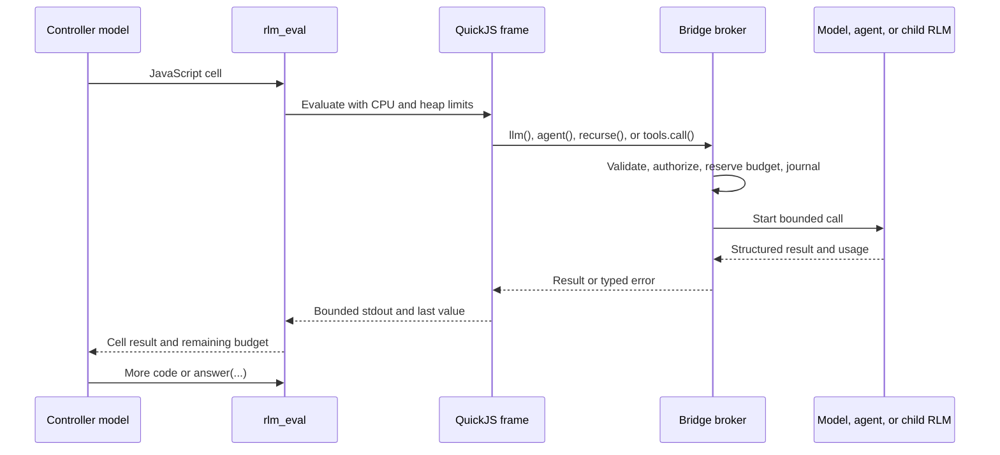

# pi-rlm design

Status: Proposed
Target: Pi extension package under `pi/extensions/pi-rlm/`
Audience: implementers and reviewers

## Decision

Build `pi-rlm` as a Pi extension that runs model-written JavaScript in a constrained QuickJS interpreter. The interpreter will expose explicit bridges for plain model calls, Pi subagents, recursive RLM frames, selected Pi tools, artifacts, approvals, and final output. Large inputs will stay in a host-backed context store. The controller model will receive metadata and selected slices rather than the complete input.

The extension will use two execution forms in one runtime:

- `llm()` makes a plain model call over a selected context slice. This follows the original Recursive Language Model design.
- `agent()` delegates a full Pi agent through the public `pi-subagents` delegation protocol. This follows Claude Code workflows and LangChain Deep Agents.
- `recurse()` starts another isolated RLM frame with a smaller context and a decremented shared budget.

The model-authored JavaScript is the adaptive control layer. An append-only event log and content-addressed call records are the durable execution format. A static DAG is not the runtime contract because an RLM must be able to branch after inspecting results.

## Context

Long inputs degrade model performance before they exceed the context window. The RLM paper addresses this by putting the input in a REPL and letting a model inspect, split, and recursively query selected parts. The paper reports successful runs on inputs up to two orders of magnitude larger than the model context window, but those results are workload and model specific.[^rlm-paper]

Claude Code dynamic workflows and LangChain Deep Agents apply the same code orchestration idea to full agents. Their controllers write loops and concurrent batches instead of issuing one tool call per model turn. This makes coverage a property of code. A loop over 300 items schedules 300 items, subject to runtime limits.[^claude-workflows][^deepagents-dynamic]

LangChain calls its implementation closer to recursive agents than the paper's RLM because `task()` launches tool-using agents instead of plain model calls over a prompt variable.[^langchain-rlm] `pi-rlm` will support both forms and keep their names distinct.

## Goals

1. Keep large source material and intermediate results out of the controller model context unless the controller selects them.
2. Let a controller write ordinary JavaScript loops, branches, reductions, and concurrent batches.
3. Support plain model calls, full Pi agents, and recursive RLM frames from the same interpreter.
4. Enforce tree-wide depth, call, concurrency, time, output, token, and cost policies.
5. Resume interrupted runs without repeating completed model or agent calls.
6. Show code, recursion, agent activity, approvals, failures, elapsed time, and usage in Pi's TUI.
7. Work in TUI, RPC, JSON, and print modes without parsing terminal output.
8. Reuse `pi-subagents` execution and lifecycle contracts instead of adding another child-agent launcher.

## Non-goals

- Training an RLM-specific model.
- Running arbitrary packages, shell commands, network requests, or filesystem operations inside QuickJS.
- Claiming that a Node worker, worktree, tool denylist, or QuickJS alone is an operating system sandbox.
- Replacing `pi-subagents`, `pi-taskflow`, or normal Pi tool calls.
- Guaranteeing lower cost or latency than a direct model call. Recursive runs add latency and can spend more at the tail.
- Supporting unattended mutating workflows in the first release.

## Prior art and adopted lessons

| System | Adopt | Do not copy |
|---|---|---|
| Original RLM | Host-backed input, selective inspection, plain `llm()` calls, recursive frames, machine-readable final output, trajectory logs | Host Python `exec`, free-text final markers, per-frame budgets that can multiply across the tree |
| Claude Code workflows | Ordinary JavaScript control flow, isolated worker contexts, phases, background progress, code review, explicit capability approval, bounded recursion | Positional call identity and implicit trust in a generated script |
| LangChain Deep Agents | QuickJS, `task()` style capability bridge, bounded output, structured results, explicit tool allowlist, nested event handles | Per-bridge approval bypass and the assumption that all recursion should use full agents |
| `pi-subagents` | Public delegation protocol, child status taxonomy, turn and tool budgets, artifacts, cancellation, nested events, fleet inspection | Importing private package internals or exposing the full subagent management surface inside QuickJS |
| `pi-dynamic-workflows` | Small imperative API, phases, progress panel, checkpoints, journal replay, model tiers | Node `vm` as a security boundary, unlimited budgets when omitted, positional replay keys |
| `pi-taskflow` | Preflight validation, stable IDs, content hashes, immutable run records, fail-closed policy enforcement | Requiring a static graph before data-dependent control flow is known |

## User entry points

The first release will not use a trigger keyword. Starting an RLM must be explicit.

### Slash commands

```text
/rlm --source docs/**/*.md --profile research -- Find incompatible design claims.
/rlm runs
/rlm inspect rlm_01J...
/rlm pause rlm_01J...
/rlm resume rlm_01J...
/rlm cancel rlm_01J...
/rlm config
```

`/rlm` intercepts the command before Pi sends the objective or source contents to the normal parent agent. It creates a dedicated controller session. This is the path that provides true context externalization.

### Parent-agent tools

```ts
rlm_run({
  objective: "Review every route for missing authorization checks.",
  sources: [{ kind: "glob", pattern: "src/routes/**/*.ts" }],
  profile: "code-review",
  background: true,
});

rlm_control({ action: "status", runId: "rlm_01J..." });
```

A normal Pi agent may use `rlm_run` when the input is already represented by file, artifact, or session references. The tool returns a run ID immediately for background runs. Completion injects only the final result, usage summary, and artifact path into the parent conversation.

## Architecture

```mermaid
flowchart TD
    U[User or parent Pi agent] --> E[Pi extension facade]
    E --> C[RLM coordinator]
    C --> S[Context and artifact store]
    C --> J[Run journal and budget ledger]
    C --> P[Controller Pi AgentSession]
    P --> T[rlm_eval tool]
    T --> Q[QuickJS worker]
    Q -->|llm| L[Plain Pi model call]
    Q -->|agent| D[pi-subagents delegation v1]
    Q -->|recurse| R[Child RLM frame]
    Q -->|tools.call()| B[Allowlisted Pi tool broker]
    R --> P
    D --> N[Child Pi process or session]
    J --> V[TUI event projection]
```

### Components

1. **Extension facade.** Registers `rlm_run`, `rlm_control`, slash commands, renderers, a status widget, and the run inspector.
2. **Coordinator.** Owns run state, frames, scheduling, cancellation, policy, usage accounting, and completion delivery.
3. **Controller session.** A Pi SDK `AgentSession` with a small system prompt and one private tool named `rlm_eval`. It sees the objective, source metadata, budget state, and DSL reference. It does not receive complete source text.
4. **QuickJS worker.** Runs one QuickJS runtime per live frame and one fresh context per cell. It has no host filesystem, network, shell, package loader, process object, environment, or wall clock.
5. **Context store.** Holds immutable source blobs and derived slices behind opaque handles. It enforces path containment, size limits, hashes, and redaction policy.
6. **Bridge broker.** Validates every guest-to-host call, reserves budget, applies capability policy, records events, and returns bounded structured data.
7. **Delegation adapter.** Uses `pi-subagents/delegation` protocol version 1 through Pi's shared event bus. It does not import `pi-subagents/src/**` files.
8. **Journal.** Persists scripts, events, call records, status, usage, approvals, and final output outside the project worktree.
9. **TUI projection.** Builds views from typed events and status records. It never scrapes child transcript text to determine state.[^pi-extensions]

## Controller loop



A controller turn ends when `answer()` commits a final value, a policy limit stops the run, the user cancels it, or the controller reaches its turn limit. Free-text controller output cannot complete a run.


## DSL

The guest language is ES2023 JavaScript with top-level `await`. Each frame exposes host-backed `input`, replayed JSON `state`, and a tree-wide `budget` view. Lexical declarations are cell-local; cross-cell values live under `state`. Effects cross typed bridges: `llm()`, `agent()`, `recurse()`, `checkpoint()`, `artifacts`, and allowlisted `tools`. `answer()` is the only completion protocol.

Every model, agent, recursive, tool, artifact, context-derivation, or checkpoint call requires a stable `key`. `phase()`, `emit()`, and logs use a journaled cell ordinal. JSON Schema validates structured results. Native `Promise.all` and `Promise.allSettled` express joins while the host scheduler enforces concurrency.

```js
const chunks = await input.chunks({ targetTokens: 6000, maxChunks: 24 });
const results = await Promise.all(chunks.map(chunk => llm({
  key: `classify:${chunk.sha256}`,
  model: { tier: "small" },
  prompt: "Return counts by category.",
  context: chunk,
  schema: countSchema,
})));
answer(reduceCounts(results));
```

The complete interfaces, error semantics, and recursive-agent examples are in the [DSL specification](pi-rlm-dsl.md).

## Execution runtime

Each frame owns a controller `AgentSession` and a QuickJS worker. All frames share one coordinator, context store, scheduler, cancellation tree, event journal, and budget ledger. Cells run as strict async functions in a pinned QuickJS Asyncify worker. Cross-process resume starts from empty state, replays completed cells, suppresses duplicate journaled effects, and returns content-addressed results for committed bridge calls.

The runtime has separate frame and leaf-work limits so recursive calls cannot deadlock the work semaphore. It enforces depth, logical calls, attempts, concurrency, wall time, heap, stored bytes, output, and context-read limits. Token and cost gates use provider-reported usage and are labeled as reported rather than hard. The default profile allows depth 3, 64 logical calls, 96 attempts, concurrency 8, 20 controller turns per frame, a 64 MiB guest heap, and 30 minutes wall time.

The full scheduler, replay, persistence, event, failure, security, and default-limit contracts are in the [execution runtime specification](pi-rlm-runtime.md).

## TUI specification

The parent transcript shows one compact run row. Active background runs also appear in a three-row widget. `/rlm inspect <id>` opens a responsive inspector with Summary, Tree, Calls, Code, Context, Events, and Budget views. Users can pause, resume, retry, cancel, inspect source handles, and resolve capability requests without adding intermediate results to model context.

```text
rlm  rlm_01J9  running  phase: independent verification
     frames 3  calls 18/64  active 6/8  failed 1  184k reported tokens  06:42
```

The complete layouts, keybindings, narrow-terminal behavior, approval dialog, and Pi component mapping are in the [TUI specification](pi-rlm-tui.md).

## Configuration and model routing

Global config lives at `~/.pi/agent/rlm/config.json`. Project config may narrow global policy at `.pi/rlm.json`; it cannot widen a deny rule without approval.

```json
{
  "profiles": {
    "research": {
      "controller": "openai-codex/gpt-5.6-sol:xhigh",
      "tiers": {
        "small": "openai-codex/gpt-5.6-luna:minimal",
        "medium": "openai-codex/gpt-5.6-terra:medium",
        "large": "openai-codex/gpt-5.6-sol:xhigh"
      },
      "opaqueAgents": {
        "researcher": "requires-run-approval",
        "reviewer": "requires-run-approval",
        "scout": "requires-run-approval"
      },
      "tools": ["read", "grep", "find"],
      "limits": {
        "maxDepth": 3,
        "maxCalls": 64,
        "maxAttempts": 96,
        "maxConcurrency": 8
      }
    }
  }
}
```

Model references use Pi's provider, model, and thinking syntax. The extension resolves them through `ModelRuntime`. Package defaults use abstract tiers rather than hard-coded model names.

## Integration with pi-subagents

`agent()` uses the exported `pi-subagents/delegation` protocol version 1. The adapter registers response listeners before it emits a request and requires a `started` event within two seconds. Missing package, listener, active extension context, or start acknowledgment returns `UNAVAILABLE_CONTEXT`.

Delegation v1 accepts a task string but no context handle or response schema. The adapter snapshots supplied contexts into `0600` files, adds a manifest of absolute paths and hashes to the task, and requests artifact capture. Schema output must be one raw JSON value. The broker parses and validates it, then spends one repair attempt when policy permits. Required protocol `context` defaults to `fresh`; `cwd` defaults to the approved project root.

A delegated agent is an opaque capability because v1 does not report effective tools, mutation access, extensions, or network access. Version 1 requires interactive approval for each named agent and source set on every run. Profiles cannot bypass it. Prompt instructions such as “do not edit” are not treated as enforcement.

The package is optional. Runtime code uses erased type-only imports and a guarded dynamic import. Pi 0.80.10 or newer is required. `agent()` additionally requires `pi-subagents` 0.35.1 or newer. The repository's current `@mariozechner/*` 0.73.1 dependencies must migrate before implementation begins. The [runtime specification](pi-rlm-runtime.md#compatibility-baseline) defines the complete matrix.

## Source layout

```text
pi/extensions/pi-rlm/
  index.ts                 extension registration
  config.ts                profiles and policy merge
  coordinator.ts           run and frame lifecycle
  controller.ts            Pi AgentSession creation
  interpreter/             QuickJS worker and RPC
  dsl/                     schemas, declarations, broker
  context/                 handles, chunking, storage
  scheduler/               ledger, queue, retry, cancellation
  delegation/              pi-subagents protocol adapter
  persistence/             events, status, replay, retention
  ui/                      renderers, widget, inspector, approvals
  test/                    unit, integration, security, TUI fixtures
  README.md
```

Files should stay below 500 lines. Runtime logic must not depend on TUI components.

## Testing and evaluation

### Unit tests

- Context slicing, chunk overlap, hashes, derivation, byte caps, and path containment.
- DSL schema validation, stable call identity, duplicate call coalescing, and final output protocol.
- Tree-wide ledger reservation under concurrent and recursive calls.
- Event ordering, atomic status writes, truncated JSONL recovery, replay, and retention.
- Capability merge rules, headless denial, and mutating retry policy.
- Pure TUI projections at widths 60, 80, 120, and 180.

### Integration tests

- A fake controller emits multiple async cells, stores cross-cell values under `state`, and completes through `answer()`.
- Restart replays `state.n = (state.n ?? 0) + 1` once, suppresses duplicate events and artifacts, and reuses committed calls.
- Recursion completes at `maxConcurrency: 1`; saturating `maxFrames` returns `BUDGET_FRAMES` instead of waiting.
- Controller provider requests and bridge calls share attempt, leaf-concurrency, token-reservation, stored-byte, and refund accounting.
- Crash injection around every payload write, `fsync`, rename, and journal append produces one authoritative event fold.
- Pause races, approval cancel/timeout, and wall timeout from every nonterminal state follow the reducer table.
- Delegation maps every terminal `pi-subagents` status, rejects a missing listener after two seconds, and validates strict JSON output.
- Normal pause drains active calls. Pause-now cancels delegated calls and records them as non-resumable attempts.
- TUI updates do not add intermediate results to parent controller or parent Pi model messages.
- Background completion delivers only to its recorded session and descendant branch.

### Security tests

Attempt `process`, `require`, dynamic import, filesystem access, network access, timers, random values, prototype escape, infinite loops, deep promise creation, oversized strings, log floods, schema bombs, path traversal, symlink escape, and recursive budget evasion. A failed test must stop release claims about isolation.

### End-to-end evaluations

Use opt-in provider tests for:

1. Exhaustive classification over a synthetic corpus with a known count.
2. Contradiction discovery across documents larger than the controller context window.
3. Repository review where every selected file must produce a result or explicit failure.
4. Restart during active fan-out, followed by resume without duplicate completed calls.
5. Comparison against direct Pi, Pi with compaction, and ordinary `pi-subagents` fan-out.

Record answer quality, coverage, wall time, total tokens, cost, controller-context growth, and tail failures. Do not claim a general quality or cost win from one benchmark.

## Delivery plan

### Phase 0: compatibility and interpreter spike

- Migrate the repository package baseline from `@mariozechner/*` 0.73.1 to supported `@earendil-works/*` 0.80.10 or newer.
- Prove one async host bridge through `quickjs-emscripten` 0.32.0 in a worker, including job pumping, heap limit, CPU interrupt, cancellation, and disposal.
- Prove optional `pi-subagents` discovery, start timeout, status mapping, and strict JSON adapter with fixtures.

Exit condition: pinned compatibility tests pass without a live provider.

### Phase 1: safe recursive core

- Context store and `/rlm` interception.
- Controller session and QuickJS worker.
- `llm()`, `recurse()`, `phase()`, `emit()`, and `answer()`.
- Hard depth, call, concurrency, time, heap, and output limits.
- Event journal, content snapshots, artifacts, strict final references, resume by cell replay, inline renderer, and text status.

Exit condition: a synthetic long-context map and reduce survives process restart with no duplicate completed calls.

### Phase 2: Pi agents and TUI

- `pi-subagents` delegation adapter and structured schemas.
- Background runs, widget, inspector, code view, approvals, pause, cancel, and retry.
- Usage accounting and model tier routing.

Exit condition: every child state and nested frame is visible and controllable from the TUI and JSON event stream.

### Phase 3: capability tools and hardening

- Allowlisted `tools.call()`, checkpoints, mutating-agent policy, and worktree options.
- Security corpus, chaos tests, retention, redaction, and optional stronger executor.

Exit condition: security tests pass and unattended mutation remains disabled by default.

### Phase 4: evaluation and package release

- Long-context and repository benchmarks.
- Versioned DSL declarations, migration policy, package docs, and examples.
- Compatibility matrix for Pi and `pi-subagents`.

## Alternatives considered

### Install `pi-dynamic-workflows`

This provides most recursive-agent workflow behavior today. It does not provide true host-backed prompt externalization or plain recursive model calls, and its Node `vm` is documented as a determinism mechanism rather than a security boundary.[^pi-dynamic] Use it when agent orchestration is enough. It is not the base for `pi-rlm`.

### Extend pi-subagents chains

Chains provide fixed sequential, parallel, and bounded structured fan-out. They do not give a model a persistent interpreter or data-dependent loops. `pi-rlm` should call their execution protocol rather than add dynamic language features to the chain format.[^pi-subagents]

### Compile a static Taskflow graph

A canonical graph is better for verification and replay when the workflow is known before execution. An RLM often chooses its next call after inspecting a prior result. The design adopts Taskflow's content identity and fail-closed policies without requiring static control flow.[^taskflow]

### Run model code in Node `vm`

Node documents that `node:vm` is not a security mechanism. Model-written code and untrusted source text make that limitation unacceptable for the primary executor. QuickJS still needs worker isolation and strict bridges, but it starts without Node ambient authority.

### Fork LangChain QuickJS middleware

LangChain has the closest interpreter semantics, but its middleware is coupled to LangGraph and Deep Agents. Reusing its public behavior as prior art while implementing a small Pi-native broker avoids bringing a second agent framework into Pi.

## Open questions

1. Should the stronger executor use a subprocess, Gondolin micro-VM, or an external container protocol after the worker MVP?
2. Can a future `pi-subagents` protocol expose trusted effective capability metadata and pre-launch token reservations?
3. Which providers offer usable external idempotency keys for mutating calls and delegated agents?
4. Should later DSL versions add a deterministic standard library for table and corpus operations?

## Acceptance criteria

The release test writes one conformance report with the metric, observed value, expected bound, and failure code for every row below.

| Property | Observable acceptance test |
|---|---|
| Context externalization | Seed source-only canaries across an input larger than the controller window. Inspect serialized provider requests. No canary or raw source range may appear except an explicitly selected slice, and selected slice bytes must stay under the configured aggregate context-return limit. Hashes and handles are allowed metadata. |
| Depth | Root is depth 0. A depth 4 request under default policy fails with `BUDGET_DEPTH` before frame creation. |
| Calls and attempts | A 64-call run plus controller turns, retries, and repairs never commits logical call 65 or attempt 97. Controller provider requests reserve a leaf slot and tokens. Cache hits consume neither count. |
| Concurrency and frames | Event projection shows peak active leaf calls at or below 8. Recursion completes with concurrency 1. Saturating all eight frame slots returns `BUDGET_FRAMES` without a queued descendant or hang. |
| Time | A stalled run reaches `timed_out` within one second of its 30 minute deadline in fake-clock tests. |
| Bytes | Per-read, per-cell, bridge, inline-final, stored-data, and journal limits each fail with their named budget code. |
| Replay and commits | Restart after a completed increment cell leaves `state.n` unchanged, emits no duplicate progress, and repeats no committed model call. Crash injection at every payload and journal boundary reconstructs the same event fold or emits `JOURNAL_CORRUPT`. |
| Unknown effects | Crash after a mutating provider response but before journal commit produces `unknown_effect` and no automatic retry. |
| State reducer | Pause versus launch, resume during drain, cancel or timeout during approval, and wall timeout from every nonterminal state produce one legal transition and terminal roll-up. |
| Source stability | Change and delete source files after ingestion. Resume reads the original snapshotted hashes and provenance. |
| Delegation | A protocol fixture covers every v1 terminal status, missing package, missing listener, strict JSON failure, repair exhaustion, and cancellation. |
| Parent isolation | Hash and byte-count assertions show only bounded cell results and the final result enter controller messages; no intermediate child transcript enters parent Pi context. |
| Modes and opaque agents | TUI and RPC approval paths resolve by correlation ID. Every opaque agent requires per-run interactive approval before background execution. JSON and print deny `agent()`, reject background work, and write no ad hoc stdout. |
| Delivery | A completed background run injects only on the origin session's descendant branch; session switches create an undelivered notification instead. |
| TUI | Snapshot and action tests pass at 50, 60, 80, 100, 120, and 180 columns. |
| Guest isolation | For the pinned QuickJS build, named probes for host globals, imports, I/O, timers, CPU, heap, and output all fail with expected codes. This does not prove OS sandboxing. |

Quality evaluation also records coverage, answer score, wall time, reported tokens, cost, controller-context growth, and p95 failure rate against direct Pi, compaction, and ordinary subagent baselines. Release notes report regressions as well as wins.

## References

[^rlm-paper]: Alex L. Zhang, Tim Kraska, and Omar Khattab, ["Recursive Language Models"](https://arxiv.org/html/2512.24601v3), 2026. See also the [official implementation](https://github.com/alexzhang13/rlm).
[^claude-workflows]: Anthropic, ["Orchestrate subagents at scale with dynamic workflows"](https://code.claude.com/docs/en/workflows) and ["A harness for every task"](https://claude.com/blog/a-harness-for-every-task-dynamic-workflows-in-claude-code), 2026.
[^deepagents-dynamic]: LangChain, ["Dynamic subagents"](https://docs.langchain.com/oss/python/deepagents/dynamic-subagents) and ["Interpreters"](https://docs.langchain.com/oss/python/deepagents/interpreters), 2026.
[^langchain-rlm]: LangChain, ["How to use RLMs in Deep Agents"](https://www.langchain.com/blog/how-to-use-rlms-in-deep-agents), 2026.
[^pi-dynamic]: Quintin Shaw, [`pi-dynamic-workflows`](https://github.com/QuintinShaw/pi-dynamic-workflows), README and runtime contract.
[^taskflow]: heggria, [`pi-taskflow`](https://github.com/heggria/pi-taskflow), README and FlowIR design.
[^pi-subagents]: Nico Bailon, [`pi-subagents`](https://github.com/nicobailon/pi-subagents), README and [`delegation` protocol](https://github.com/nicobailon/pi-subagents/blob/main/src/api/delegation.ts).
[^pi-extensions]: Pi, [extension API](https://github.com/earendil-works/pi-mono/blob/main/packages/coding-agent/docs/extensions.md), [SDK](https://github.com/earendil-works/pi-mono/blob/main/packages/coding-agent/docs/sdk.md), and [TUI components](https://github.com/earendil-works/pi-mono/blob/main/packages/coding-agent/docs/tui.md).
